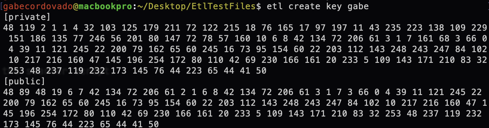
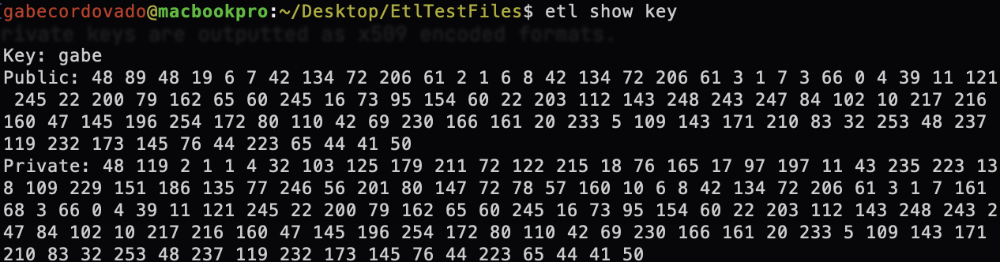

# etl-client
Developed by Gabriel Cordovado.

## Install Instructions
The following instructions can be used to run the etl client on nix-based operating systems. Testing on Windows operating systems is limited.

### Build
Build the command line client by running the following commands in the repositories working directory. Then add the build folder to your os environment path **/etc/paths**
```shell
mkdir build
go build -o build/etl
```

### Verification
The version command can be used to verify that the command-line is build and added to the environment path correctly. The command should output the version and current date.
```
etl version
```

## Commands

### version
Outputs the version of the etl client and current time.

---

### help
Provides descriptions for available parameters.

---

### debug
Provides verbose output for the starter script.

---

### key
Generated ECDSA public and private keys are outputted as x509 encoded formats.

### Variants

#### create key [identifier]
Create a new ECDSA key public and private key pair, saving it locally to the system. This key can be used to communicate with ETLFramework cores
across networks over RPC. You can label keys with an optional *identifier* so that it can be referenced at a later time. If not identifier is provided, a random
string will be generated to identify the key.



#### show key
Outputs all ECDSA key pairs and their respective identifier saved to the local system.



---

### deploy
Runs the default entrypoint into the etl project.

---

### project

#### Variants

##### create project [project-name]
Creates a new ETL project associated with the <name> parameter.

##### show project
Displays all the projects created on the local system

---

### cluster

#### Variants

##### create cluster [cluster-name]
Creates a new cluster source and test file associated with the <name> parameter.

##### delete cluster [cluster-name]
Deletes a cluster source and test file

##### show cluster
Displays all clusters associated with the project with respective date-created, developer, and contact metadata.

---

### mount

#### Variants

##### create mount [cluster-name]
Adds a cluster to the automount list in the config. When deployed, anyone with permission will be able to invoke the cluster.

##### delete mount [cluster-name]
Removes a cluster from the automount list in the config. When deployed, the cluster will need to be manually mounted before it can be invoked over RPC.

##### show mount
Shows a list of clusters that are automount in the project.

---

### cluster

#### Variants

##### 
---

### permission

#### Variants

---

### endpoint

#### Variants